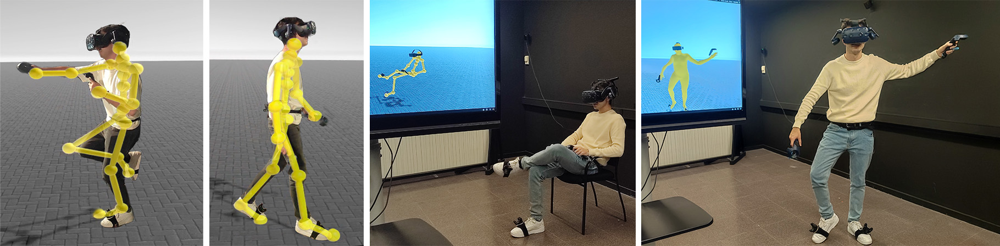

# SparsePoser: Real-time Full-body Motion Reconstruction from Sparse Data

[Jose Luis Ponton<sup>*,1</sup>](https://joseluisponton.com/), [Haoran Yun<sup>*,1</sup>](https://haoranyun.com), [Andreas Aristidou<sup>2,3</sup>](http://andreasaristidou.com), [Carlos Andujar<sup>1</sup>](https://www.cs.upc.edu/~andujar), [Nuria Pelechano<sup>1</sup>](https://www.cs.upc.edu/~npelechano)<br/>

<sup>1</sup> [Universitat Politècnica de Catalunya (UPC)](https://www.upc.edu/en?set_language=en), Spain <br/>
<sup>2</sup> [University of Cyprus](https://www.ucy.ac.cy/?lang=en), Cyprus <br/>
<sup>3</sup> [CYENS Centre of Excellence](https://www.cyens.org.cy/en-gb/), Cyprus <br/>
<sup>*</sup> [Jose Luis Ponton](https://joseluisponton.com/) and [Haoran Yun](https://haoranyun.com) are joint first authors.
<p align="center">
</p>

---

<p align="center">
  
</p>

This repository contains the implementation of the method shown in the paper *SparsePoser: Real-time Full-body Motion Reconstruction from Sparse Data* published at the **ACM Transactions on Graphics**.

Get an overview of the paper by visiting the [project website](https://upc-virvig.github.io/SparsePoser/) or watching the [video](https://www.youtube.com/embed/TODO)!

Download the paper [here](https://acm.com/TODO)!

---

## Contents

1. [Structure](#structure)
2. [Quick Start](#quick-start)
   * [BVH Evaluation](#bvh-evaluation)
   * [Unity Demo](#unity-demo)
3. [Data](#data)
4. [Training](#training)
5. [Citation](#citation)
6. [License](#license)


## Structure

The project is divided into two folders: ``SparsePoserUnity`` with the Unity project, and ``python`` with the network implementation using PyTorch. The network is executed in Python and the results are sent to Unity via a TCP connection.

## Quick Start

1. Clone the repository.
2. ``cd SparsePoser/python/``
3. ``python -m venv env`` (tested on Python 3.9).
4. Active the virtual environment.
5. ``pip install -r requirements.txt``
6. Install [PyTorch](https://pytorch.org/get-started/locally/)
7. Download the [motion dataset](https://zenodo.org/TODO) and unzip it.
> ``python/`` folder should look like this:
```
└───python
    ├───data
    │   └───xsens
    │       ├───eval
    │       └───train
    ├───env
    ├───models 
    │   ├───model_dancedb
    │   └───model_xsens
    └───src
```

### BVH Evaluation

1. ``python .\src\eval.py .\models\model_xsens\ .\data\xsens\eval\S01_A09_3.bvh ik``
> You can try to synthesize motion from any other .bvh file in the .\data\xsens\ folder.

> Change ``ik`` by ``generator`` to synthesize motion only using the generator network.
2. The result will be saved in TODO

### Unity Demo

**Unity** (for live demo)

3. Install **Unity 2021.2.13f1** (other versions may work but are not tested).

TODO...
  - Add instructions to run the demo.

### Training

1. [Optional] Adjust hyperparameters in ``python .\src\train.py`` param dictionary.
2. ``python .\src\train.py .\data\xsens\ train_test all``
> ``python .\src\train.py <train_db> <name> <generator|ik|all>
3. The result will be saved in ``models\model_<name>_<train_db>

## Data

TODO...

## Citation

If you find this code useful for your research, please cite our paper:
```
@article{ponton2023sparseposer,
}
```

## License
This work is licensed under CC BY-SA 4.0.
The project and data is available for free, and may be redistributed under these conditions. Please, see the [license](LICENSE) for further details.
